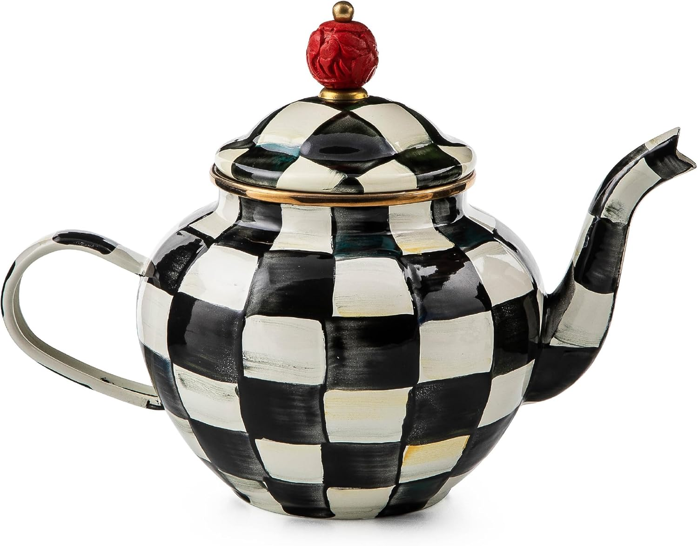
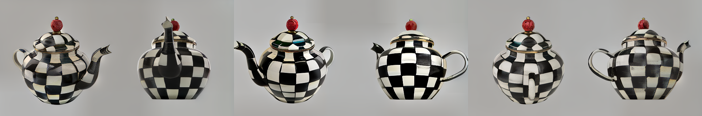
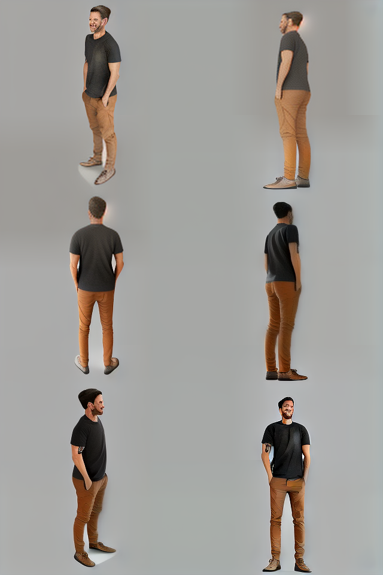

# Multi-View Generation with Zero123++

Zero-mv wraps the [Zero123++](https://huggingface.co/sudo-ai/zero123plus-v1.2) model into a **simple, reproducible project** for generating **multi-view images** from a single input.  

The goal: make it **easy to experiment locally** with Zero123++ in a familiar, reproducible project structure.

---

## Motivation — Multi-View from One Image

[Zero123++](https://github.com/cvlab-columbia/zero123) (Zero-1-to-3)is an **image-conditioned diffusion model** that generates **six consistent views** of a 3D object from a single input image.  

This enables:
- **Rapid 3D asset creation** for simulation, robotics, AR/VR
- **Dataset bootstrapping** for 3D/pose research
- **Interactive exploration** of view consistency

Zero123++ v1.2 produces a **fixed rig of 6 views** (azimuths: 30°, 90°, 150°, 210°, 270°, 330°; elevations alternating 20° / –10°).  

---
## Example : Teapot


## Output : 6 poses of Teapot


## Example : Person → 6 poses of Person


---

## Highlights
- **Monolithic backend**: no external scripts — loads Zero123++ via Hugging Face `diffusers` pipeline
- **Simple CLI**: `zero_mv --image input.jpg --out outputs/run`
- **Config-driven**: pass `--config config.yaml` to avoid long CLI args
- **Contact sheet output**: see all 6 views in one grid
- **Cross-platform**: runs on macOS (MPS), Linux CPU, and Linux CUDA (T4+)

---

## Repo Layout
```
.
├── README.md
├── clean.sh
├── .env.example
├── config.yaml.example
├── examples
│   ├── person.jpg
│   ├── person_results.png
│   ├── person_results2.png
│   ├── teapot.jpg
│   └── teapot_results.png
├── pyproject.toml
├── setup.sh
├── src
│   └── zero_mv
│       ├── __init__.py
│       ├── cli.py
│       ├── utils
│       │   ├── cameras.py
│       │   ├── devices.py
│       │   └── image.py
│       └── zero123pp.py
│  
└── zero-mv-banner.png
````

---

## Quickstart

### Clone & permissions
```bash
git clone https://github.com/guybarnahum/zero-mv.git
cd zero-mv
chmod +x setup.sh clean.sh
````

### Install

**macOS (CPU/MPS)**:

```bash
./setup.sh
```

**Linux + NVIDIA GPU (e.g. T4, Ampere)**:

```bash
TORCH_CHANNEL=cu124 ./setup.sh t4_gpu
```

The installer:

* Creates `.venv`
* Installs **platform-specific PyTorch** (MPS, CPU, or CUDA)
* Installs project dependencies from `pyproject.toml` (`.[cpu]` or `.[t4_gpu]`)

---

## Run

```bash
# Basic run
zero_mv --image examples/teapot.jpg --out outputs/demo

# Custom steps
zero_mv --steps 24 --image input.png --out outputs/custom
```

Output:

* `outputs/demo/zpp_grid.png` → combined grid (all 6 views)
* `outputs/demo/000_zpp_view.png ... 005_zpp_view.png` → split tiles

### Using a config file

`custom_config.yaml`:

```yaml
image: examples/teapot.jpg
out: outputs/from_config
steps: 28
grid: true
```

Run:

```bash
zero_mv run --config custom_config.yaml
```

Notice: `custom.yaml` is used as defaults, overriden by cli arguments.

---

## Uninstall / Clean

```bash
# Full clean: uninstall package, remove .venv, wipe caches/artifacts
./clean.sh

# Non-interactive
./clean.sh --yes
```

---

## Notes

* **Inference steps**: `--steps` is passed to the pipeline, but some versions of Zero123++ always default to 36 steps internally.
* **MPS (Mac)**: If you see “MPS out of memory,” try:

  ```bash
  export PYTORCH_MPS_HIGH_WATERMARK_RATIO=0.0
  zero_mv run --steps 24 --image examples/teapot.jpg --out outputs/zpp
  ```

  Also reduce `--steps` (20–24) or input size (`to_square(..., min_side=256)`).
* **Hugging Face**: If you need private models, set `HF_TOKEN` or `HUGGINGFACE_HUB_TOKEN` in .env or export into the environment before running `setup.sh`.

---

## 📖 Citation

If you use **zero-mv** or build upon it in your research, please cite the original Zero-1-to-3 work:

```bibtex
@misc{liu2023zero1to3,
      title        = {Zero-1-to-3: Zero-shot One Image to 3D Object},
      author       = {Ruoshi Liu and Rundi Wu and Basile Van Hoorick and Pavel Tokmakov and Sergey Zakharov and Carl Vondrick},
      year         = {2023},
      eprint       = {2303.11328},
      archivePrefix= {arXiv},
      primaryClass = {cs.CV}
}
````

**Reference:**
Ruoshi Liu, Rundi Wu, Basile Van Hoorick, Pavel Tokmakov, Sergey Zakharov, and Carl Vondrick.
*Zero-1-to-3: Zero-shot One Image to 3D Object*. arXiv:2303.11328, 2023.
\[[arXiv](https://arxiv.org/abs/2303.11328)]

---

## License


MIT © 2025 zero-mv contributors

