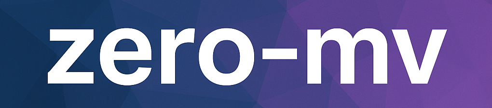

# Zero-MV — Multi-View Generation with Zero123++

**zero-mv** wraps the [Zero123++](https://huggingface.co/sudo-ai/zero123plus-v1.2) model into a **simple project** for generating **multi-view images** from a single input.  

The goal: make it **easy to experiment locally** with Zero123++ in a reproducible and portable project structure.

---

## Motivation — Multi-View from One Image

[Zero123++](https://github.com/cvlab-columbia/zero123) (Zero-1-to-3) is an **image-conditioned diffusion model** that generates **six consistent views** of a 3D object from a single input image.  

This enables:
- **Rapid 3D asset creation** for simulation, robotics, AR/VR
- **Dataset bootstrapping** for 3D/pose research
- **Interactive exploration** of view consistency

Zero123++ v1.2 produces a **fixed rig of 6 views** (azimuths: 30°, 90°, 150°, 210°, 270°, 330°; elevations alternating 20° / –10°).  

---

## Example: Teapot


### Output: 6 poses of Teapot


## Example: Person → 6 poses of Person


<details>
<summary><h1>More Examples > </h1></summary>

### Home → 6 poses


### Dinosaur → 6 poses


### Fish → 6 poses


</details>

---

## Highlights
- **Monolithic backend**: no extra scripts — loads Zero123++ via Hugging Face `diffusers`
- **Simple CLI**: `zero_mv run --image input.jpg --out outputs`
- **Config-driven**: pass `--config config.yaml` (args always override config values)
- **Organized outputs**: images stored under `outputs/{basename}/`
- **Consistent naming**: `000_person_view.png … person_views_grid.png`
- **Cross-platform**: runs on macOS (MPS), Linux CPU, and Linux CUDA (T4+)

---

## Repo Layout
```

.
├── README.md
├── clean.sh
├── .env.example
├── config.yaml.example
├── examples
│   ├── person.jpg
│   ├── person\_results.png
│   ├── person\_results2.png
│   ├── teapot.jpg
│   └── teapot\_results.png
├── pyproject.toml
├── setup.sh
├── src
│   └── zero\_mv
│       ├── **init**.py
│       ├── cli.py
│       ├── utils
│       │   ├── cameras.py
│       │   ├── devices.py
│       │   └── image.py
│       └── zero123pp.py
└── zero-mv-banner.png

````

---

## Quickstart

### Clone & permissions
```bash
git clone https://github.com/guybarnahum/zero-mv.git
cd zero-mv
chmod +x setup.sh clean.sh
````

### Install

**macOS (CPU/MPS)**:

```bash
./setup.sh
```

**Linux + NVIDIA GPU (e.g. T4, Ampere)**:

```bash
TORCH_CHANNEL=cu124 ./setup.sh t4_gpu
```

The installer:

* Creates `.venv`
* Installs **platform-specific PyTorch** (MPS, CPU, or CUDA)
* Installs project dependencies from `pyproject.toml` (`.[cpu]` or `.[t4_gpu]`)

---

## Run

```bash
# Basic run (teapot example)
zero_mv run --image examples/teapot.jpg --out outputs
```

Output files go to `outputs/teapot/`:

```
outputs/teapot/
├── 000_teapot_view.png
├── 001_teapot_view.png
├── 002_teapot_view.png
├── 003_teapot_view.png
├── 004_teapot_view.png
├── 005_teapot_view.png
├── teapot_views_grid.png   # model grid
└── teapot_views_sheet.png  # contact sheet (optional)
```

### Custom steps

```bash
zero_mv run --steps 24 --image input.png --out outputs
```

### Using a config file

`custom_config.yaml`:

```yaml
image: examples/teapot.jpg
out: outputs
steps: 28
grid: true
```

Run:

```bash
zero_mv run --config custom_config.yaml
```

> CLI args always override config values (e.g. `--steps 20` wins over YAML).

---

## Uninstall / Clean

```bash
# Full clean: uninstall package, remove .venv, wipe caches/artifacts
./clean.sh

# Non-interactive
./clean.sh --yes
```

---

## Notes

* **Inference steps**: Some Zero123++ pipelines still default internally to 36 steps even if fewer are requested.
* **MPS (Mac)**: If you see “MPS out of memory,” try:

  ```bash
  export PYTORCH_MPS_HIGH_WATERMARK_RATIO=0.0
  zero_mv run --steps 24 --image examples/teapot.jpg --out outputs
  ```

  You can also lower `--steps` (20–24) or resize input (`to_square(..., min_side=256)`).
* **Hugging Face**: For private models, set `HF_TOKEN` or `HUGGINGFACE_HUB_TOKEN` in `.env` or export it before running `setup.sh`.

---

## 📖 Citation

If you use **zero-mv** or build upon it in your research, please cite the original Zero-1-to-3 work:

```bibtex
@misc{liu2023zero1to3,
      title        = {Zero-1-to-3: Zero-shot One Image to 3D Object},
      author       = {Ruoshi Liu and Rundi Wu and Basile Van Hoorick and Pavel Tokmakov and Sergey Zakharov and Carl Vondrick},
      year         = {2023},
      eprint       = {2303.11328},
      archivePrefix= {arXiv},
      primaryClass = {cs.CV}
}
```

**Reference:**
Ruoshi Liu, Rundi Wu, Basile Van Hoorick, Pavel Tokmakov, Sergey Zakharov, and Carl Vondrick.
*Zero-1-to-3: Zero-shot One Image to 3D Object*. arXiv:2303.11328, 2023.
[arXiv link](https://arxiv.org/abs/2303.11328)

---

## License

MIT © 2025 zero-mv contributors

